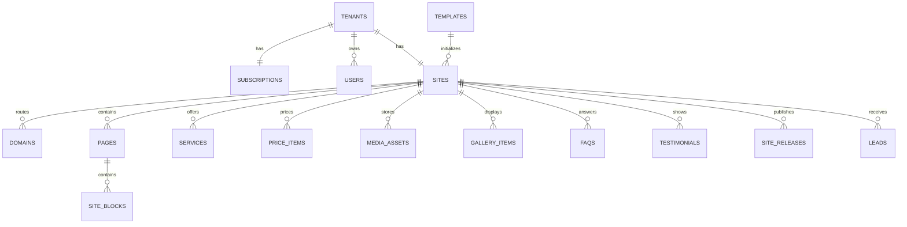

# Thiết kế PostgreSQL — Website Builder SaaS MVP

## 1. Kết luận thiết kế

Thiết kế này bám theo `SRS_Website_Builder_SaaS_MVP.md` và tối ưu cho MVP:

- Một database, dùng chung schema, mọi dữ liệu nghiệp vụ có `tenant_id`.
- Một tenant có đúng một site trong MVP (`sites.tenant_id UNIQUE`).
- CMS lưu dữ liệu draft ở các bảng chuẩn hóa.
- Mỗi lần publish tạo một snapshot JSONB bất biến trong `site_releases`.
- Public website chỉ đọc release được trỏ bởi `sites.current_release_id`.
- Tenant isolation được thực hiện ở service/repository và có PostgreSQL Row-Level Security (RLS) làm lớp bảo vệ thứ hai.
- Composite foreign key buộc entity con và entity cha phải thuộc cùng tenant/site, ngăn dữ liệu bị gắn nhầm tenant ngay tại database.
- UUID dùng cho entity public; audit log dùng `bigint identity` vì chỉ là chuỗi sự kiện nội bộ.
- Tiền dùng `numeric(14,2)`, thời gian dùng `timestamptz`, email/hostname dùng `citext`.

Script khởi tạo: `001_initial_schema.sql`.

## 2. Những điểm đã điều chỉnh so với entity gợi ý trong SRS

| Điểm trong SRS | Thiết kế chốt | Lý do |
|---|---|---|
| Plan/status nằm trực tiếp trong `tenants` | Tách `subscriptions` | Tránh trộn trạng thái khách hàng và vòng đời thuê bao; sẵn sàng thêm billing sau MVP. |
| URL ảnh nằm rải rác | Dùng FK đến `media_assets` | Quản lý archive, quota, metadata và tránh URL mồ côi. |
| Chỉ block có `version_type` | Draft chuẩn hóa + `site_releases.snapshot` | Publish toàn bộ site nhất quán, bao gồm site settings, page, block, service, price, gallery, FAQ và testimonial. |
| Gallery chỉ nhắc `media_assets` | Thêm `gallery_items` | Một ảnh trong thư viện chưa đồng nghĩa với việc ảnh xuất hiện trong gallery; cần caption, thứ tự và visibility riêng. |
| Session chưa có entity | Thêm `auth_sessions` | Hỗ trợ HttpOnly session cookie, revoke và expiry server-side. |
| `tenant.plan` và `tenant.status` cùng chứa trial | `tenants.status` + `subscriptions.status` | Tenant status thể hiện khả năng vận hành; subscription status thể hiện thương mại. |

## 3. Sơ đồ quan hệ chính



## 4. Nhóm bảng

### Nền tảng và xác thực

- `tenants`: doanh nghiệp thuê dịch vụ; `slug` là định danh ổn định, unique và chặn reserved words.
- `subscriptions`: plan, trạng thái thuê bao, ngày bắt đầu/kết thúc.
- `users`: platform admin có `tenant_id = NULL`; customer owner bắt buộc có tenant.
- `auth_sessions`: chỉ lưu hash của session token, không lưu token gốc.
- `templates`: cấu hình và nội dung mặc định của template.

### Site draft

- `sites`: brand settings và trạng thái site.
- `site_contact_settings`: phone, email, social link, địa chỉ, map và giờ mở cửa.
- `domains`: subdomain/custom domain; mỗi site chỉ có tối đa một primary domain.
- `pages`: bốn page cố định của MVP và SEO từng page.
- `site_blocks`: block content linh hoạt bằng JSONB; `block_key` ổn định để template/editor định danh block.
- `services`, `price_items`, `faqs`, `testimonials`: dữ liệu nội dung có cấu trúc.
- `media_assets`: metadata file trong object storage.
- `gallery_items`: liên kết ảnh với gallery và quản lý thứ tự hiển thị.

### Publish và vận hành

- `site_releases`: snapshot bất biến của toàn bộ nội dung public tại một thời điểm.
- `leads`: dữ liệu liên hệ; luôn có cả `tenant_id` và `site_id` để scope/filter hiệu quả.
- `ai_generation_logs`: theo dõi feature, provider/model, token và lỗi; cần mask PII trước khi ghi input/output.
- `audit_logs`: log append-only cho thao tác quan trọng.

## 5. Cơ chế draft, preview và publish

### Draft

CMS ghi trực tiếp vào các bảng chuẩn hóa. Preview đọc các bảng này theo `tenant_id` lấy từ session, không lấy tenant từ request body/query string.

### Publish

Publish nên chạy trong một transaction:

1. Lock site bằng `SELECT ... FOR UPDATE` để chặn hai publish đồng thời.
2. Kiểm tra tenant/subscription được phép hoạt động.
3. Kiểm tra business name, contact phone, SEO title, hero và tối thiểu một service active.
4. Đọc toàn bộ draft và tạo một JSON object hoàn chỉnh.
5. Tính `version = max(version) + 1` của site và insert `site_releases` với status `published`.
6. Update `sites.current_release_id`, `status = 'published'`, `last_published_at = now()`.
7. Ghi `audit_logs`, rồi commit.

Nếu bất kỳ bước nào lỗi, transaction rollback và public site vẫn dùng release cũ. Không xóa release cũ; có thể rollback bằng cách đổi `current_release_id` về release trước.

Snapshot đề xuất:

```json
{
  "schemaVersion": 1,
  "site": {},
  "contact": {},
  "pages": [
    {
      "slug": "home",
      "seo": {},
      "blocks": []
    }
  ],
  "services": [],
  "priceItems": [],
  "gallery": [],
  "faqs": [],
  "testimonials": []
}
```

Public rendering theo hostname:

1. Chuẩn hóa hostname về lowercase, bỏ port và dấu chấm cuối.
2. Tìm `domains.hostname` với `status = active`.
3. Kiểm tra tenant không suspended/cancelled, subscription hợp lệ và site published.
4. Đọc đúng một row `site_releases` qua `sites.current_release_id`.
5. Cache theo hostname + release id. Release id đổi thì cache key tự đổi.

## 6. Tenant isolation

Không dựa riêng vào RLS. Áp dụng đồng thời ba lớp:

1. Session xác định `user_id`, `role`, `tenant_id` ở server.
2. Repository/service luôn scope query bằng tenant hiện tại.
3. Trong cùng transaction, backend chạy:

```sql
SELECT set_config('app.tenant_id', :tenant_id, true);
```

Sau đó RLS chỉ cho đọc/ghi row có `tenant_id` tương ứng. Database role của ứng dụng không được là superuser, owner của bảng hoặc có `BYPASSRLS`. Platform Admin nên dùng service/repository riêng có kiểm tra role rõ ràng; không dùng tenant API để truy cập chéo tenant.

Lưu ý với connection pool/Prisma: `set_config(..., true)` chỉ có hiệu lực trong transaction. Vì vậy tenant-scoped query và câu `set_config` phải chạy trên cùng transaction/connection.

## 7. Ràng buộc nghiệp vụ quan trọng

- Tenant slug: 3–50 ký tự, lowercase, không bắt đầu/kết thúc bằng `-`, không thuộc reserved list.
- Email user unique không phân biệt hoa thường.
- Platform admin không có tenant; customer owner bắt buộc có tenant.
- Chỉ một site cho một tenant trong MVP.
- Chỉ một primary domain trên một site, và primary domain phải active.
- Mỗi site có một page cho mỗi `page_type` và không trùng slug.
- Giá được kiểm tra theo `price_type`; range phải có `max >= min`.
- Rating testimonial từ 1 đến 5.
- Ảnh tối đa 5 MiB và chỉ nhận JPEG/PNG/WebP trong DB; backend vẫn phải kiểm tra magic bytes, không chỉ MIME/extension.
- Lead message tối đa 1.000 ký tự.
- Xóa service dùng `status = archived`; không hard delete nếu đã được lead tham chiếu.

Các giới hạn theo plan (số ảnh, số service, custom domain) nên kiểm tra trong transaction ở application service. Không đặt CHECK constraint vì chúng phụ thuộc dữ liệu ở nhiều bảng và có thể đổi theo chính sách giá.

## 8. Index phục vụ API trong SRS

- Tenant list/search: unique slug, user email; khi dữ liệu lớn có thể thêm `pg_trgm` cho tìm gần đúng tên.
- Host routing: unique `domains.hostname`.
- Service/price/FAQ/testimonial/gallery: index `(site_id, status/visibility, sort_order)`.
- Lead list: `(tenant_id, status, created_at DESC)` và `(site_id, created_at DESC)`.
- Lead search: `(tenant_id, phone)` và `(tenant_id, lower(full_name))`.
- Audit/AI log: `(tenant_id, created_at DESC)`.
- Release: `(site_id, version DESC)`.

Không tạo GIN index cho mọi JSONB ngay từ đầu. Public site đọc snapshot theo primary key, còn block được lấy theo page; GIN chỉ cần khi xuất hiện truy vấn thật sự vào thuộc tính JSONB.

## 9. Quy tắc xóa dữ liệu

- `RESTRICT`: tenant, subscription, user/site nghiệp vụ quan trọng; tránh xóa nhầm toàn bộ khách hàng.
- `CASCADE`: dữ liệu con thuần túy của site như page/block/gallery/release, nhưng thao tác xóa site chỉ dành cho quy trình quản trị đặc biệt.
- `SET NULL`: ảnh hoặc user bị xóa không làm mất lead/audit/release.
- `archive/inactive`: service, price, FAQ, testimonial, media; đây là cách xóa bình thường trong CMS.

MVP nên chưa cung cấp API hard delete tenant/site. Khi cần xóa dữ liệu theo yêu cầu, thực hiện job riêng có audit, thời gian chờ và backup.

## 10. Các transaction quan trọng

- Tạo tenant: tenant → subscription → owner → site → contact → domain → pages → blocks mặc định.
- Publish site: validate → snapshot → release → current release → audit.
- Đặt primary domain: bỏ primary cũ và bật primary mới trong cùng transaction.
- Tạo lead: kiểm tra tenant/site/release đang public rồi insert; gửi email sau commit hoặc qua job/outbox để lỗi email không làm mất lead.
- Archive media: kiểm tra logo/favicon/page/service/gallery/block còn tham chiếu trước khi archive.

## 11. Phần nên bổ sung ở migration tiếp theo

P0 schema hiện tại đủ cho SRS MVP. Các phần sau chỉ thêm khi triển khai chức năng tương ứng:

- `password_reset_tokens` nếu chuyển từ reset thủ công sang link reset qua email.
- `notification_outbox` để retry email lead an toàn.
- `domain_verification_attempts` nếu tự động verify DNS.
- `usage_counters` nếu quota theo plan trở thành điểm nóng hiệu năng.
- `lead_status_history` nếu cần lịch sử chăm sóc lead thay vì chỉ audit chung.
- `site_release_assets` nếu cần garbage-collect ảnh mà vẫn bảo toàn release cũ.

## 12. Thứ tự triển khai đề xuất

1. Chạy schema trên database development.
2. Tạo database roles riêng cho migration, application và read-only support.
3. Seed ba template, reserved domain rules và một platform admin.
4. Viết transaction tạo tenant đầy đủ, không tạo từng entity rời rạc qua nhiều request.
5. Viết repository bắt buộc nhận tenant context.
6. Viết publish service và test rollback/concurrent publish.
7. Viết integration test tenant A không thể đọc/sửa dữ liệu tenant B.
8. Thêm backup, restore drill và retention trước production.

## 13. Kiểm thử database bắt buộc

- Không thể tạo hai tenant cùng slug hoặc hai user có email khác hoa/thường.
- Không thể tạo customer owner không có tenant hay platform admin có tenant.
- Không thể tạo primary domain chưa active hoặc hai primary domain cho cùng site.
- Không thể ghi giá sai với từng `price_type`.
- Publish lỗi giữa chừng không đổi `current_release_id`.
- Hai publish đồng thời không tạo trùng version.
- RLS chặn tenant A đọc, sửa và xóa dữ liệu tenant B.
- Public hostname không hợp lệ/failed/pending không route tới site.
- Tenant suspended hoặc subscription suspended không nhận lead.
- Archive service không xóa `leads.interested_service_id` hiện có; hard delete nếu buộc thực hiện sẽ set null.

## 14. Lưu ý khi dùng Prisma

- PostgreSQL enum map tốt với Prisma enum.
- `citext` có thể cần `@db.Citext` tùy phiên bản Prisma; nếu không dùng native type thì normalize email trước khi lưu và giữ unique index `lower(email)`.
- JSONB map sang `Json`.
- RLS không thay thế middleware authorization của ứng dụng.
- Trigger `updated_at` vẫn hữu ích dù Prisma tự set `@updatedAt`, nhất là khi chạy SQL/job trực tiếp.
- Migration nên được tạo/kiểm soát ở SQL hoặc Prisma Migrate, không dùng `db push` trên production.

## 15. Quyết định còn cần Product Owner xác nhận

1. Một email có thể sở hữu nhiều tenant trong tương lai không? Schema MVP đang coi email đăng nhập là unique toàn hệ thống.
2. Khi subscription `past_due`, public site còn hiển thị trong bao lâu?
3. Release cũ cần giữ vĩnh viễn hay chỉ 10–20 phiên bản gần nhất?
4. Platform Admin có được xem nội dung lead mặc định hay chỉ khi hỗ trợ có lý do/audit?
5. Dữ liệu lead giữ bao lâu và quy trình xóa theo yêu cầu khách hàng là gì?

Các câu hỏi này không chặn MVP schema, nhưng cần chốt trước khi production hóa chính sách dữ liệu và billing.
