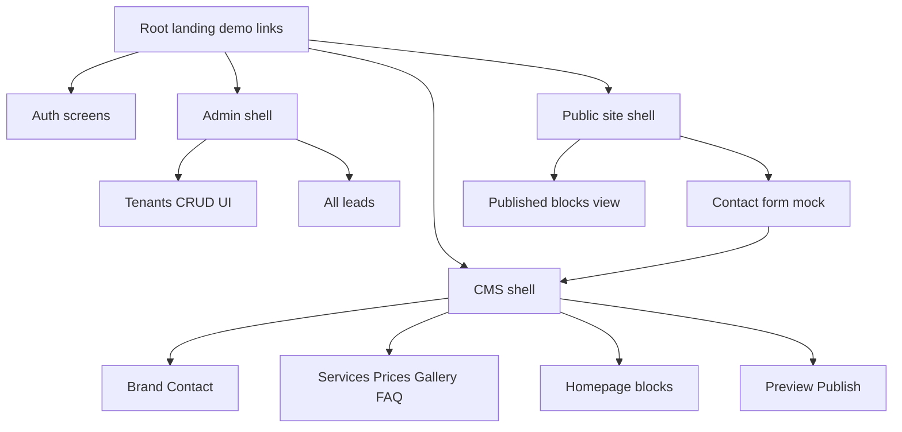

# Plan: UI Mock toàn bộ MVP — Website Builder SaaS

## Quyết định đã chốt

| Hạng mục | Quyết định |
|---|---|
| Phạm vi | UI mock full MVP: Admin + CMS + Public |
| Data | Mock data tĩnh, chưa gắn API/DB |
| Public demo | Route group `(public-site)` |
| UI kit | shadcn/ui + Tailwind 4 |
| Visual Admin/CMS | SaaS sạch, mềm và thân thiện hơn Linear |
| Visual Public | Template Spa/Salon demo đẹp, responsive |
| AI / Upload / Auth thật | Chỉ mock UI, không tích hợp backend |

---

## 1. Mục tiêu

Xây UI xem được end-to-end theo SRS mục 8:

1. Platform Admin quản lý tenant/site/leads
2. Customer CMS chỉnh nội dung website
3. Public website hiển thị blocks + form liên hệ
4. Demo flow: tạo tenant → chỉnh CMS → preview/publish → public → lead → xem lead

Không làm trong phase này: Prisma, auth session thật, storage, AI provider, multi-host subdomain thật.

---

## 2. Hiện trạng

- Next.js 16 + React 19 + Tailwind 4 + TypeScript trong `web/`
- Route skeleton đã có: `(admin)`, `(cms)`, `(auth)`, `(public-site)`
- Admin layout + dashboard demo tồn tại nhưng nội dung sai domain (đơn hàng/doanh thu)
- Hầu hết page CMS/Auth/Public trống
- `components/`, `features/`, `lib/`, `types/`, `services/` chưa có code

---

## 3. Kiến trúc UI

```text
web/src/
  app/
    (auth)/
      login/page.tsx
      admin/login/page.tsx
      cms/login/page.tsx
    (admin)/admin/
      layout.tsx
      page.tsx
      tenants/page.tsx
      tenants/new/page.tsx
      tenants/[tenantId]/page.tsx
      tenants/[tenantId]/domains/page.tsx
      leads/page.tsx
    (cms)/cms/
      layout.tsx   # chuyển layout vào đúng group cms nếu cần
      page.tsx
      settings/page.tsx
      settings/brand/page.tsx
      settings/contact/page.tsx
      pages/page.tsx
      pages/home/page.tsx
      services/page.tsx
      services/new/page.tsx
      services/[serviceId]/edit/page.tsx
      prices/page.tsx
      gallery/page.tsx
      faq/page.tsx
      leads/page.tsx
      leads/[leadId]/page.tsx
      seo/page.tsx
      preview/page.tsx
    (public-site)/
      layout.tsx
      page.tsx              # home
      services/page.tsx
      gallery/page.tsx
      contact/page.tsx
      suspended/page.tsx
      unpublished/page.tsx
    page.tsx                # mini landing nội bộ link demo
  components/
    ui/                     # shadcn primitives
    layout/                 # sidebar, topbar, page-header, empty-state
  features/
    auth/
    admin/
    cms/
    public-site/
  lib/
    mock/
    utils.ts
  types/
    domain.ts
```



---

## 4. Design system

### Phong cách Admin/CMS
- Nền sáng: soft gray/slate
- Surface: white card, border nhẹ, shadow rất nhẹ
- Accent: blue ấm hoặc teal dịu (không quá cold như Linear)
- Radius: `rounded-xl` / `rounded-2xl`
- Spacing rộng, form rõ label tiếng Việt
- Sidebar gọn, icon lucide, active state mềm
- Status badge màu pastel dễ đọc

### Phong cách Public (Spa demo)
- Primary color mock từ brand settings
- Hero lớn, ảnh placeholder chất lượng
- Section spacing rõ, CTA nổi
- Mobile-first, button dễ bấm

### shadcn components ưu tiên cài
- button, input, textarea, label, select
- checkbox, switch, badge, card
- table, dialog, dropdown-menu, tabs
- separator, avatar, skeleton, sonner/toast
- form helpers nếu cần

### Shared app components
- `PageHeader`, `StatCard`, `EmptyState`, `ConfirmDialog`
- `StatusBadge`, `SearchInput`, `FilterBar`, `Pagination`
- `FileDropzone` (mock), `ColorField`, `AiSuggestButton` (mock modal)
- `AdminSidebar`, `CmsSidebar`, `PublicHeader`, `PublicFooter`

---

## 5. Mock data

Dataset demo:

- Users: 1 platform admin, 2 customer owners
- Tenants: active / trial / suspended
- Sites: 1 published Spa, 1 draft/unpublished
- Services: 6–8
- Price items: 5–8
- Gallery: 8–12 placeholder images
- FAQ: 5, Testimonials: 4
- Leads: 8–12 multi-status
- Homepage blocks đầy đủ theo SRS

File gợi ý:
- `types/domain.ts`
- `lib/mock/users.ts`
- `lib/mock/tenants.ts`
- `lib/mock/sites.ts`
- `lib/mock/services.ts`
- `lib/mock/prices.ts`
- `lib/mock/gallery.ts`
- `lib/mock/faqs.ts`
- `lib/mock/testimonials.ts`
- `lib/mock/leads.ts`
- `lib/mock/blocks.ts`
- `lib/mock/index.ts`

Interaction mock:
- Save draft → toast “Đã lưu bản nháp”
- Publish → confirm + toast “Đã công khai website”
- AI → modal nội dung gợi ý + áp dụng vào field
- Upload → chọn file hiển thị preview local, không upload server
- Login → validate mock credentials cứng, redirect theo role

---

## 6. Chi tiết màn hình

### Auth
| URL | UI |
|---|---|
| `/login` | Chọn vào Admin hoặc CMS |
| `/admin/login` | Form email/password + error |
| `/cms/login` | Form email/password + error |

### Admin
| URL | UI |
|---|---|
| `/admin` | Stats tenant / published / lead mới + recent tenants |
| `/admin/tenants` | Search, filter status, table, pagination, CTA tạo |
| `/admin/tenants/new` | Form tạo tenant + template + password mode |
| `/admin/tenants/[id]` | Detail sections + actions suspend/reset/open site |
| `/admin/tenants/[id]/domains` | Subdomain + custom domain mock |
| `/admin/leads` | Cross-tenant leads + filters |

### CMS
| URL | UI |
|---|---|
| `/cms` | Website status, URL, quick actions, lead mới |
| `/cms/settings` | Hub brand/contact |
| `/cms/settings/brand` | Brand form |
| `/cms/settings/contact` | Contact form |
| `/cms/pages` | 4 pages cố định |
| `/cms/pages/home` | Block list + toggle + editor panel |
| `/cms/services` | List/search/add |
| `/cms/services/new` + edit | Service form + AI mock |
| `/cms/prices` | Price items management |
| `/cms/gallery` | Library + caption/alt + select public |
| `/cms/faq` | CRUD + AI FAQ mock |
| `/cms/leads` + detail | List/filter/status/note |
| `/cms/seo` | Default SEO + AI mock |
| `/cms/preview` | Device frames + publish CTA |

### Public `(public-site)`
| Route | UI |
|---|---|
| `/` trong group public-site | Home full blocks |
| `/services` | Service list + CTA |
| `/gallery` | Grid + lightbox |
| `/contact` | Info + form + map + social |
| `/suspended` | Trang tạm ngưng |
| `/unpublished` | Trang đang cập nhật |

> Lưu ý implement: hiện `(public-site)` map root paths. Cần giữ mini landing riêng hoặc dùng query/state demo. Khi code, ưu tiên:
> - Root marketing/demo hub nếu cần điều hướng nội bộ
> - Public template pages theo group hiện có
> - Có thể thêm links demo suspended/unpublished

---

## 7. Wording tiếng Việt (SRS 18.2)

| Tránh | Dùng |
|---|---|
| Hero Section | Banner đầu trang |
| CTA | Nút kêu gọi liên hệ |
| SEO Metadata | Thông tin hiển thị trên Google |
| Publish | Công khai website |
| Unpublish | Tạm ẩn website |
| Tenant | Khách hàng / đơn vị |
| Lead | Khách để lại liên hệ |

---

## 8. Thứ tự triển khai

1. **Foundation**
   - Setup shadcn/ui
   - Design tokens / globals
   - Types + mock data + utils
   - Shared UI/layout components

2. **Auth UI**
   - `/login`, `/admin/login`, `/cms/login`

3. **Admin UI**
   - Layout menu đúng domain
   - Dashboard, tenants list/create/detail/domains, leads

4. **CMS shell + settings + pages/blocks**
   - Layout CMS
   - Dashboard, brand/contact, pages, homepage editor

5. **CMS content modules**
   - Services, prices, gallery, FAQ, leads, SEO, preview

6. **Public website**
   - Layout + blocks + 4 pages + suspended/unpublished

7. **UX polish**
   - Empty/loading/error/confirm
   - Responsive
   - Consistency visual + copy

---

## 9. Definition of Done

- [ ] Đủ màn SRS 8.1–8.3 xem được
- [ ] Mock data tập trung, tái sử dụng
- [ ] shadcn/ui dùng nhất quán
- [ ] Admin/CMS style SaaS sạch, mềm, thân thiện
- [ ] Public Spa template responsive
- [ ] Demo flow chính chạy trên UI
- [ ] `npm run dev` không lỗi compile các màn chính

---

## 10. Ngoài phạm vi

- Backend API / Prisma / PostgreSQL
- Auth cookie/session thật
- Object storage upload
- AI provider
- Hostname multi-tenant thật
- Thanh toán / analytics / drag-drop builder

---

## 11. Bước tiếp theo

Chuyển **Code mode** và implement theo todo list từ Foundation → Auth → Admin → CMS → Public → Polish.
